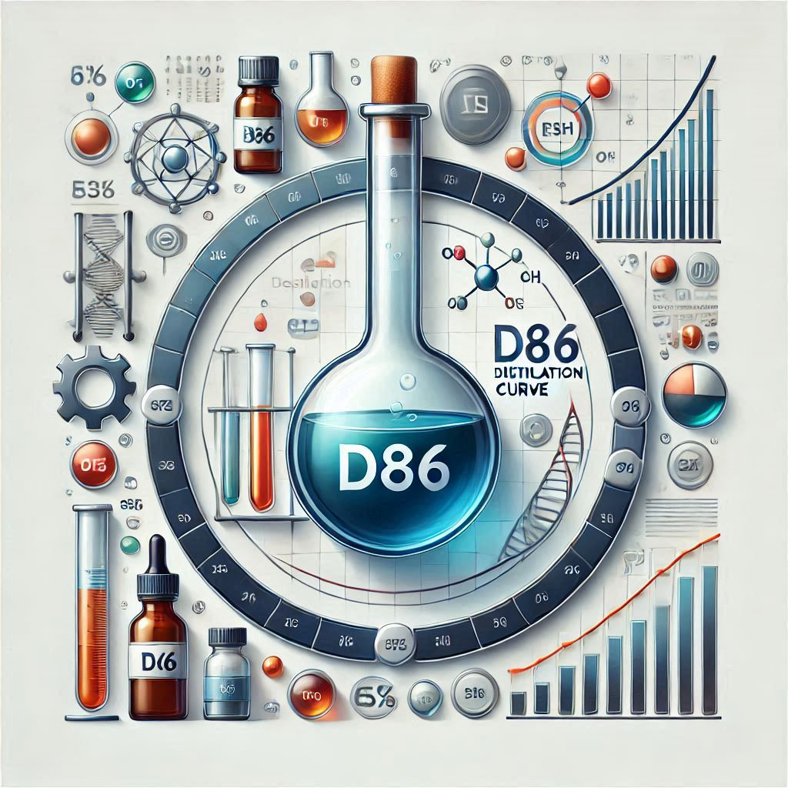

# Distillation Curve Interconversion Tool

A comprehensive Python application for converting between different petroleum distillation curve types: ASTM D86, ASTM D2887 (SimDis), and TBP (True Boiling Point).



## Features

### Core Functionality
- **Multi-format Support**: Convert between D86, D2887, and TBP distillation curves
- **Dual Basis Handling**: Support for both volume % and weight % basis
- **Multiple Correlation Methods**: 
  - API (1993) method for D86-TBP conversion
  - Daubert (1994) method for D86-TBP conversion
  - Riazi-Daubert correlation for D86-D2887 conversion
- **Property Calculations**: Automatic calculation of VABP, MeABP, Watson K factor

### GUI Application
- **Interactive Data Entry**: Easy-to-use table interface for distillation data
- **Real-time Visualization**: Dynamic plotting of all distillation curves
- **Flexible Input**: Add custom distillation points beyond standard cuts
- **Professional Output**: Export to CSV and Excel formats
- **Three-panel Display**: Separate views for plots, data tables, and properties

### Command-Line Module
- **Programmatic Access**: Use as a Python module in your own scripts
- **Batch Processing**: Process multiple datasets programmatically
- **Integration Ready**: Easy integration into existing workflows

## Installation

### Prerequisites
- Python 3.12 or higher
- uv package manager (recommended) or pip

### Using uv (Recommended)
```bash
cd Distillation_Curve_interconv
uv sync
```

### Using pip
```bash
cd Distillation_Curve_interconv
pip install -r requirements.txt
```

### Dependencies
- **matplotlib**: Plotting and visualization
- **scipy**: Scientific computing and interpolation
- **PySide6**: GUI framework (Qt for Python)
- **pandas**: Data manipulation
- **openpyxl**: Excel file export

## Quick Start

### GUI Application
```bash
# Using uv
uv run python distillation_converter_gui.py

# Or directly
python distillation_converter_gui.py
```

### Python Module
```python
from bp_conversions import Oil

# Read D86 data from CSV
d86_data = Oil.read_d86_csv('your_data.csv')

# Create Oil object with density
oil = Oil(d86_data, Density=820)  # Density in kg/m³

# Access converted curves
d86_temp_at_50 = oil.D86_interp(50)      # D86 at 50% distilled
d2887_temp_at_50 = oil.D2887_interp(50)  # D2887 at 50% distilled
tbp_temp_at_50 = oil.TBP_interp(50)      # TBP at 50% distilled

# Access properties
print(f"VABP: {oil.VABP:.2f} °F")
print(f"MeABP: {oil.MeABP:.2f} °F")
print(f"Watson K: {oil.WatsonK:.2f}")

# Plot all curves
oil.plot_TBP_D86()
```

## Usage Examples

### Example 1: Converting Diesel D86 Data

Input data (D86 atmospheric distillation):
```
Vol %    Temp (°C)
0        180
10       220
30       260
50       290
70       320
90       350
100      370
```

The application will convert to:
- **D2887 (SimDis)**: ~5-15°C higher than D86
- **TBP**: ~10-20°C higher than D86
- Also calculates VABP, MeABP, Watson K

### Example 2: Processing SimDis (D2887) Results

If you have D2887 data from GC analysis:
1. Select "D2887 (SimDis - GC)" as input type
2. Choose "Weight %" basis (typical for GC)
3. Enter your SimDis temperatures
4. Convert to D86 for product specifications

### Example 3: Batch Processing

```python
import pandas as pd
from bp_conversions import Oil

# Read multiple samples
samples = pd.read_excel('multiple_samples.xlsx', sheet_name=None)

results = []
for sample_name, data in samples.items():
    # Convert DataFrame to list format
    d86_data = [[row['Vol%'], row['Temp']] for _, row in data.iterrows()]
    
    # Process
    oil = Oil(d86_data, Density=data['Density'].iloc[0])
    
    results.append({
        'Sample': sample_name,
        'VABP': oil.VABP,
        'MeABP': oil.MeABP,
        'Watson_K': oil.WatsonK,
        'D2887_50': oil.D2887_interp(50),
        'TBP_50': oil.TBP_interp(50)
    })

# Save results
pd.DataFrame(results).to_excel('conversion_results.xlsx', index=False)
```

## Technical Background

### Distillation Methods Comparison

| Method | Type | Efficiency | Application |
|--------|------|------------|-------------|
| **D86** | Physical distillation | Low (few theoretical plates) | Product specifications, QC |
| **D2887** | Gas chromatography | Very high | Modern process control, SimDis |
| **TBP** | Physical distillation | High (many plates) | Refinery design, simulation |

### Typical Temperature Relationships
```
D86 < D2887 ≈ TBP
```

The differences arise from:
- Distillation efficiency
- Heat losses in apparatus
- Thermodynamic equilibrium conditions

### Conversion Methods

#### API Method (1993)
Power-law correlation: `TBP_R = a × D86_R^b`

Where a and b are constants dependent on volume % distilled, temperatures in Rankine.

#### Daubert Method (1994)
Incremental temperature difference approach, more accurate for middle distillates.

#### Riazi-Daubert for D2887
Modified correlation optimized for simulated distillation by gas chromatography.

## File Structure

```
Distillation_Curve_interconv/
├── bp_conversions.py              # Core conversion module
├── distillation_converter_gui.py  # GUI application
├── main.py                        # Alternative entry point
├── Qt Plot GUI.py                 # Legacy GUI (spline plotting)
├── pyproject.toml                 # Project configuration
├── uv.lock                        # Locked dependencies
├── README.md                      # This file
├── GUI_USER_GUIDE.md             # Detailed GUI documentation
├── D2887_CONVERSION_NOTES.md     # Technical notes on D2887
├── D86 Distillation.csv          # Example data
├── Kero D86.csv                  # Example data (kerosene)
└── daubert_index.csv             # Correlation constants
```

## Documentation

- **[GUI User Guide](GUI_USER_GUIDE.md)**: Complete guide for the graphical interface
- **[D2887 Conversion Notes](D2887_CONVERSION_NOTES.md)**: Technical details on D2887 method
- **API Documentation**: See docstrings in `bp_conversions.py`

## Data Format

### CSV Input Format
```csv
Vol%,Temperature
0,180
10,220
30,260
50,290
70,320
90,350
100,370
```

- First column: Volume or weight percentage (0-100)
- Second column: Temperature in °C
- Header row optional (auto-detected)

## Validation and Quality Assurance

The application includes several validation checks:
- ✓ Minimum 3 data points required
- ✓ Temperature monotonicity validation
- ✓ Physical range checks (typical petroleum range)
- ✓ Density validation (600-1200 kg/m³)
- ✓ Smooth interpolation using PCHIP

## Limitations

1. **Applicable Range**: 
   - Final boiling point ≤ 538°C (1000°F)
   - Not suitable for gasoline (use ASTM D7096)

2. **Accuracy**:
   - Most accurate for middle distillates (kerosene, diesel, gas oil)
   - Less accurate for very light or very heavy fractions

3. **Basis Conversion**:
   - Internal vol% ↔ wt% conversion assumes ideal mixing
   - For precise work, use measured data in the correct basis

## Contributing

Contributions are welcome! Areas for improvement:
- Additional correlation methods
- Support for D1160 (vacuum distillation)
- Database of typical petroleum fractions
- Advanced plotting options
- Uncertainty quantification

## References

1. **ASTM D86-23**: Standard Test Method for Distillation of Petroleum Products at Atmospheric Pressure
2. **ASTM D2887-23**: Standard Test Method for Boiling Range Distribution of Petroleum Fractions by Gas Chromatography
3. **API Technical Data Book** - Petroleum Refining (1993), American Petroleum Institute
4. **Daubert, T. (1994)**: "Petroleum Fractions Distillation Interconversion", *Hydrocarbon Processing*, Vol. 73, No. 9, p. 75
5. **Riazi, M.R. and Daubert, T.E. (1980)**: "Simplify Property Predictions", *Hydrocarbon Processing*, Vol. 59, No. 3, p. 115
6. **Riazi, M.R. (2005)**: "Characterization and Properties of Petroleum Fractions", ASTM International

## License

This project is provided for educational and research purposes. Please ensure compliance with applicable ASTM standards when using for commercial applications.

## Version History

### Version 1.0 (October 2025)
- Initial release
- D86, D2887, TBP interconversion
- GUI application with PySide6
- Export to CSV and Excel
- Property calculations (VABP, MeABP, Watson K)

## Support

For issues, questions, or suggestions:
- Check the [GUI User Guide](GUI_USER_GUIDE.md)
- Review the [D2887 Conversion Notes](D2887_CONVERSION_NOTES.md)
- Examine example data files included in the repository

---

**Developed for petroleum refining and research applications**  
**Compatible with Python 3.12+ and modern scientific computing stack**
